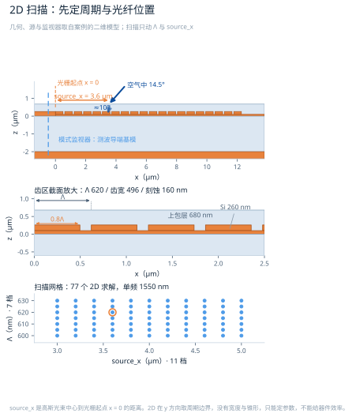
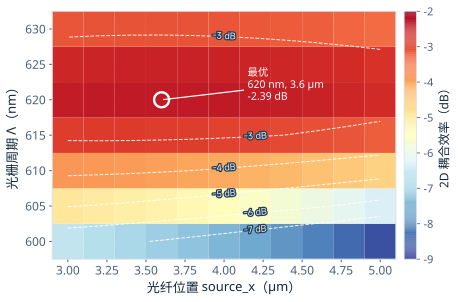
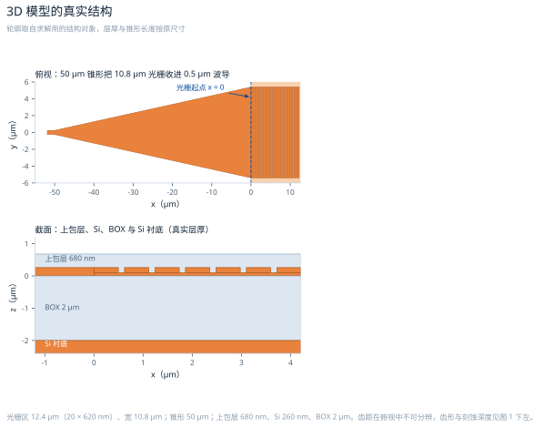
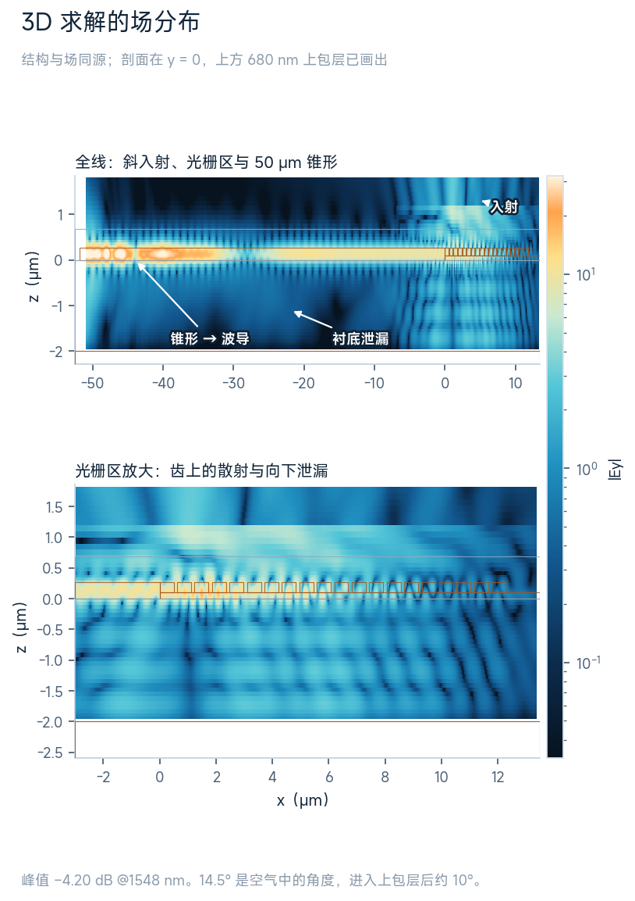
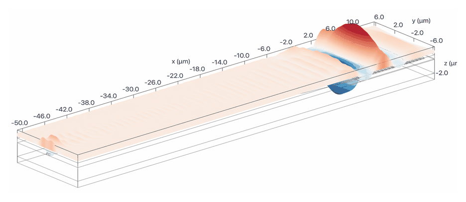

# 一排齿，怎么把光拐进波导？

这是本系列的第二篇。上一篇把地图铺开了，这一篇从最简单的一种做起：**均匀线性光栅**。

它只有两个设计变量——周期和光纤位置。听起来简单，但正因为简单，你能把“光为什么进不去”这件事看得最清楚。

我们用的是学习中心里的 [Uniform linear grating coupler](https://www.lingcompute.com/photon/learning-center/examples/notebooks/GratingCoupler) 案例，SOI 平台：硅 260 nm、部分刻蚀 160 nm、占空比 0.8、20 个齿，上方 680 nm SiO₂ 上包层，下方 2 μm BOX。

## 先算周期，再谈别的

上一篇给过光栅方程。要对上 1550 nm、14.5° 入射，周期该取多少？

方程里缺一个量：波导的等效折射率。而光栅区有两个折射率——没刻蚀的平板一处、刻蚀后的薄板一处。这里先建一个 2D 仿真，在光栅区左右两侧各切一刀做模式求解（上包层与 BOX 都保留）：

- 未刻蚀平板：**n_eff = 2.9522**
- 刻蚀后薄板：**n_eff = 2.1784**

按 0.8 的占空比线性加权，代回光栅方程：

Λ = λ0 / ( neff − nc sin θc )，neff = 0.8 × 2.9522 + 0.2 × 2.1784 = 2.7974

Λ = 1550 nm / ( 2.7974 − 0.2504 ) ≈ 608 nm

θ 这一项容易算错：模型上方是 680 nm SiO₂，光纤在空气里倾斜 14.5°，进包层后按 Snell 折射到约 10°。相位匹配只看到不变量 nc sin θc = sin 14.5° = 0.2504，式中直接写 0.2504；若拿 1.44 × sin 14.5° 去算，会得到 636 nm，差出 28 nm。

这一步值得停一下。它说明周期不是“调”出来的，是**算**出来的——材料、刻蚀深度、入射角一旦定死，周期就只剩一个答案。

但这个答案只准到十几纳米。扫描找到的峰值在 620 nm；由 620 nm 反推的 n_eff 约 2.750，比 0.8 加权的 2.797 低 1.7%，12 nm 的偏差就来自这个线性近似。照 608 nm 去加工，效率要掉 2 dB 以上。所以下一步仍然要扫。

## 为什么不直接做 3D 扫描

扫描有两个层次，先做哪个由成本决定。

2D 只解一个截面：y 方向取周期边界，结构在 y 上无限延伸，既没有 10.8 μm 的宽度，也没有 50 μm 锥形。它算得快——本次单次 2D 求解约 **0.025 credits**，同等网格精度下的 3D 求解约 **0.685 credits**，差 **27 倍**。把 77 个点摊开：2D 扫描约 1.9 credits，同样规模直接做 3D 扫描约 53 credits，还没算三维网格收敛要多试的几次。

所以分工是清楚的：**2D 定参数，3D 出结果**。2D 回答“周期和光束落点该取多少”，因为它对这两个量的趋势足够敏感；3D 才回答“这个器件能到多少 dB”，因为宽度、锥形过渡和三维模式匹配只有到 3D 才出现。把 2D 的数字直接当器件指标，会高估近 2 dB——这一点在图 3 与图 5 的对比里能直接看出来。

## 2D 扫的是哪两个量

扫的是 **周期 Λ** 和 **光束位置 source_x**：

- **Λ** 取 600–630 nm 七档，步长 5 nm。范围以算出的 608 nm 为中心，左右各留约 20 nm。
- **source_x** 取 3–5 μm 十一档，步长 0.2 μm。它是高斯光束中心到光栅起点 x = 0 的距离——2D 里没有真光纤，这个量标的是光束落在光栅的哪一段，对应 3D 里光纤的横向位置。
- 每个点单频 1550 nm，在波导端放一个模式监视器，量出有多少光变成基模（基模振幅的 |a|²）。

一共 77 个 2D 求解，就是图 1 右下那张网格。

结果有意思的地方不在最优点，而在**形状**。

数值最优在 620 nm、3.6 μm，−2.39 dB。沿周期方向：620 nm 两侧偏 5 nm 分别掉 0.5 dB 和 0.1 dB，偏 10 nm 掉 1.6 dB 和 0.7 dB——短周期侧明显更陡。沿光纤位置方向却几乎是水平带：3–5 μm 整段只差 0.25 dB，最优的 3.6 μm 与次优点 3.4 μm 之间只差 0.01 dB，落在网格分辨之内。

这说明两件事的敏感度完全不对称：

- **周期是硬约束。** 它由相位匹配决定，短周期侧尤其敏感：偏 5 nm 约 0.5 dB，偏 10 nm 约 1.6 dB。10 nm 的偏差就足以把 4.2 dB 的器件推到 5.8 dB。
- **光纤位置是软约束。** 它决定入射光斑落在光栅的哪一段，影响的是模式重叠，不是相位；3–5 μm 整段只差 0.25 dB，偏 1 μm 约 0.1 dB。

工程含义很直接：版图上的周期控在 5 nm 以内，代价约 0.5 dB；封装对准留 1 μm 余量，代价约 0.1 dB。

## 2D 最优点的场：光是怎么漏下去的

数字只给了 57.7%，看不出光去了哪儿。把最优点那一组几何原样再跑一次（加一个场监视器，仍然是一次 2D），场就摊开了。

三个细节值得注意：

- 光束在空气里是 14.5°，进 SiO₂ 之后明显变陡，约 10°——这就是上一节那个 0.2504 的来源。
- 每个齿下方都有一个局部热点，齿间相位连续，说明它确实按一个漏波工作，而不是一堆独立散射体。
- 向下泄漏的条纹是斜的、连续的，一路走到 BOX 以下；这正是 2D 里“往衬底漏”的样子，也是 3D 收支里 26.3% 的来处。

## 3D：多了 50 μm 的锥形

2D 里光栅是整个宽度上无限延伸的，也没有锥形过渡；真实器件有边界。案例把 2D 的结果搬到 3D，加了两个东西。

一是**宽度**。光栅宽度取光纤的模场直径 10.8 μm（本案例高斯光源腰斑 5.4 μm，与上一篇引用的通用单模光纤 10.4 μm 是两个取值），而单模波导只有 0.5 μm 宽，中间靠一段 **50 μm 的线性锥形**过渡。

二是**损耗**。这段锥形不是免费的。光从 10.8 μm 宽的平板模收缩到 0.5 μm 宽的条波导，模式形状一路在变，理想绝热需要很长的距离，50 μm 显然不够。

3D 峰值 **−4.20 dB @1548 nm**，比 2D 在 1550 nm 的 −2.39 dB 低约 1.8 dB。两者口径不同：2D 没有有限宽度和锥形损耗，−2.39 dB 只是二维上限，不是器件指标。有限宽度、锥形过渡和三维模式匹配都可能参与这 1.8 dB；本次没有逐项分离，不能指定锥形占比。

## 功率去哪了：一次完整的收支

只看 −4.20 dB 这个数，你不知道该改哪里。所以我们在同一个 3D 任务里补了三个监视器，把入射功率的去向拆开。以下是 1550 nm 的读数（峰值在 1548 nm）：

- 进入波导基模：**37.8%**（−4.23 dB）
- 下方监视器净下行通量：**26.3%**（不是吸收功率）
- 上方平面的向上总通量：**19.8%**（不是返回光纤模式的功率）
- 其余约 16%：未计入基模的高阶模与辐射，未做闭合面分解

这张图说清了三件事。

**第一，净下行通量大于向上反射总通量。** 26% 对 20%。BOX/硅界面会产生 Fresnel 反射，往返相位影响方向性；下方通量不能被解释成材料吸收。本次没有 BOX 厚度扫描，不能认定 2 μm 是唯一原因或加厚必然改善。

**第二，波长一变，三条去路此消彼长。** 往短波走，衬底泄漏冲到 59%；往长波走，它又涨回 61%。中间那段低谷正好对着效率峰值——因为相位匹配最好的时候，往上的分量最强。

**第三，3 dB 带宽 69 nm，1 dB 带宽 39 nm。** 两者都相对峰值定义。实际可用窗口还需要满足系统允许的绝对插损，不能仅由峰高决定。

## 这一篇的结论

均匀光栅的价值不在性能，在于它把每个量的作用都摊开了：

- 周期由相位匹配确定，短周期侧更陡：10 nm 约 1.6 dB，长周期侧约 0.7 dB。版图上按 5 nm 内控，代价约 0.5 dB。
- 光纤位置是软约束，3–5 μm 整段只差 0.25 dB，偏 1 μm 约 0.1 dB，封装余量可以给到微米。
- 2D 定参数、3D 出结果：单次 2D 比 3D 便宜 27 倍，但 −2.39 dB 只是二维上限，器件要到 3D 才是 −4.20 dB。
- 本次净下行通量大于向上反射总通量；它们都不是吸收或激光反馈的直接测量。

下一篇处理的就是“模式和相位”这两件事：把填充因子做成位置的函数，让漏出的场对上光纤的高斯形状；再把直的齿弯成圆弧，让它们聚焦到同一点。

---

完整 Notebook 在[学习中心](https://www.lingcompute.com/photon/learning-center/examples/notebooks/GratingCoupler)。国内产品入口为 [tidy3d.fangzhen.cloud](https://tidy3d.fangzhen.cloud/)，注册与运行路径本次未验证，请以平台当前文档为准。
